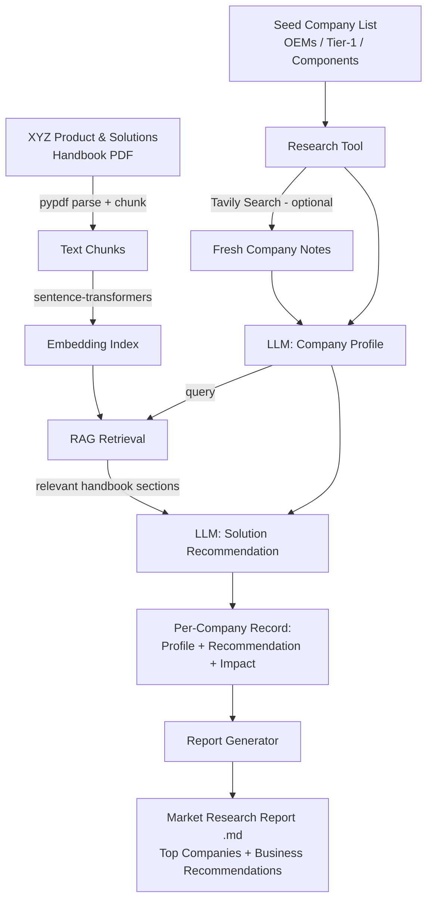

# AI-Powered Sales Intelligence Agent
### XYZ Analytics Consulting — Indian Automotive Market

## 1. Project Overview

This project is an agentic pipeline that researches the Indian automotive industry, identifies high-potential OEMs, Tier-1 suppliers, and component manufacturers, and recommends the most suitable consulting solution from XYZ Analytics Consulting's Product & Solutions Handbook (Warranty Analytics, Supply-Chain Risk Prediction, or Dealer & Field Service Intelligence) for each target company.

The agent combines:
- **A curated research base** of major Indian automotive OEMs, Tier-1 suppliers, and component manufacturers, optionally enriched with live web search for current context.
- **Retrieval-Augmented Generation (RAG)** over the XYZ Product & Solutions Handbook, so every recommendation is grounded in XYZ's actual capabilities, KPIs, and case studies rather than generic advice.
- **An LLM reasoning step** that profiles each company and maps its likely pain points to the single best-fit XYZ solution, with justification.

Output: a Market Research Report covering the top target companies with tailored recommendations and business rationale.

A sample output from a complete run is included in this repo: [`Market_Research_Report.md`](./Market_Research_Report.md).

## 2. Setup & Execution Instructions

1. Open `Sales_Intelligence_Agent.ipynb` in Google Colab.
2. Run cells top to bottom.
3. When prompted, enter:
   - A **Groq API key** (free) — https://console.groq.com/keys
   - A **Tavily API key** (free, optional — used for live company research; leave blank to skip and rely on the LLM's own knowledge + handbook RAG)
4. When prompted, upload the XYZ Product & Solutions Handbook PDF.
5. The notebook will:
   - Parse and chunk the handbook, and build sentence-embedding vectors for retrieval.
   - Loop through the seed company list, generating a profile and a solution recommendation for each.
   - Assemble a full Market Research Report (`Market_Research_Report.md`) and trigger a download.

No API keys are hardcoded anywhere in the notebook — they are entered securely at runtime via `getpass`.

## 3. Tools, Frameworks & Models Used

| Component | Choice |
|---|---|
| Development environment | Google Colab |
| LLM | Llama 3.3 70B (open-source), served via Groq API |
| Web search (optional, for fresh context) | Tavily Search API |
| PDF parsing | pypdf |
| Embeddings / retrieval | sentence-transformers (`all-MiniLM-L6-v2`), cosine similarity |
| Orchestration | Custom Python pipeline (research tool → RAG retrieval tool → LLM reasoning step → report generator) |

**Why a custom pipeline instead of CrewAI/Agno:** given the project timeline, a lightweight, fully custom orchestration was chosen for reliability and transparency — each tool call (search, retrieval, generation) is an explicit, inspectable Python function rather than hidden inside a framework's abstraction. The pipeline follows the same conceptual pattern a framework like CrewAI would enforce: a research tool, a knowledge/retrieval tool, and a reasoning agent, coordinated by a controller loop.

## 4. Architecture

**Flow summary:**
1. The handbook is parsed once and embedded into a searchable knowledge base.
2. For each target company, the Research Tool builds a profile using general knowledge plus optional live search.
3. The profile is used as a query against the handbook embeddings to retrieve the most relevant sections (RAG).
4. The LLM reasons over the profile + retrieved handbook context to pick the single best-fit XYZ solution and justify it.
5. All company records are aggregated into a final Market Research Report with business recommendations.

## 5. Sample Output

A full end-to-end run is included at [`Market_Research_Report.md`](./Market_Research_Report.md), containing:
- An executive market overview of the Indian automotive industry
- Company profiles and solution recommendations for major Indian OEMs, Tier-1 suppliers, and component manufacturers, each justified against the XYZ Product & Solutions Handbook
- A closing Business Recommendations section covering solution prioritization and outreach sequencing

## 6. Assumptions & Known Limitations

- **Seed company list is curated, not scraped.** Given the project timeline, the target company list (major Indian OEMs, Tier-1 suppliers, and component manufacturers) was compiled from public industry knowledge (SIAM/ACMA member companies) rather than live-scraped from LinkedIn/NSE/Screener/etc. Live web search (Tavily) is used to add current context on top of this base, not to discover the companies from scratch.
- **Live search is optional and rate-limited.** If no Tavily key is provided, or the free tier is exhausted, the agent falls back to the LLM's own knowledge plus handbook RAG — profiles may be less current in that case.
- **LLM outputs are not fact-checked against real-time filings.** Figures like warranty spend or revenue are illustrative/handbook-derived where cited, not pulled from live financial statements.
- **Solution recommendation is single-best-fit per company.** In reality a company might benefit from more than one XYZ solution; the agent is designed to recommend the single highest-priority one for a first sales conversation.
- **RAG uses a lightweight retrieval method** (cosine similarity over sentence-transformer embeddings, no vector database) — appropriate for the size of the handbook (single document, ~15 chunks) but would need a proper vector store (e.g. FAISS, Chroma) to scale to a larger knowledge base.
